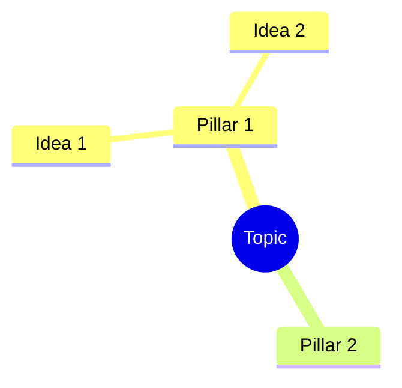
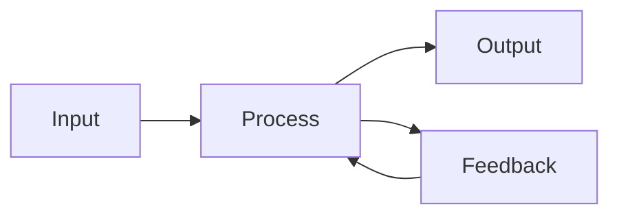
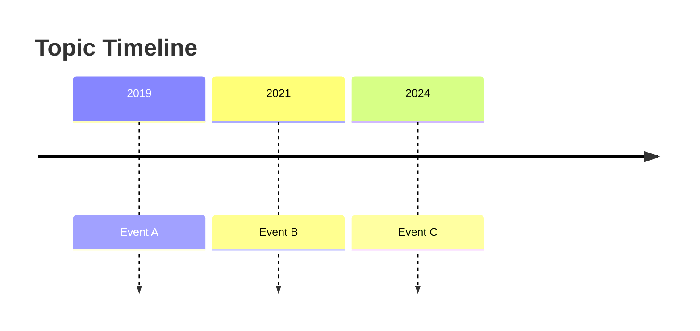
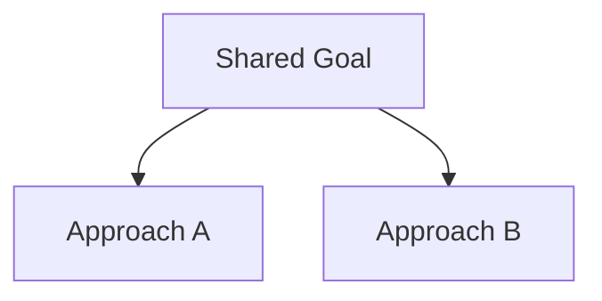

# Diagram Snippets (Mermaid)

## Concept Map

```mermaid
%%{init: {"flowchart": {"useMaxWidth": true, "nodeSpacing": 35, "rankSpacing": 45}} }%%
mindmap
  root((Topic))
    Pillar 1
      Idea 1
      Idea 2
    Pillar 2
```

## Process Flow

```mermaid
%%{init: {"flowchart": {"useMaxWidth": true, "nodeSpacing": 35, "rankSpacing": 45}} }%%
flowchart LR
  A[Input] --> B[Process]
  B --> C[Output]
  B --> D[Feedback]
  D --> B
```

## Timeline

```mermaid
%%{init: {"flowchart": {"useMaxWidth": true, "nodeSpacing": 35, "rankSpacing": 45}} }%%
timeline
  title Topic Timeline
  2019 : Event A
  2021 : Event B
  2024 : Event C
```

## Compare/Contrast

```mermaid
%%{init: {"flowchart": {"useMaxWidth": true, "nodeSpacing": 35, "rankSpacing": 45}} }%%
flowchart TB
  S[Shared Goal]
  A[Approach A]
  B[Approach B]
  S --> A
  S --> B
```
