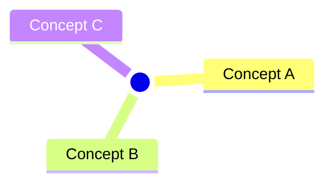

# DIGEST - <Topic>

## 30-Second Summary

-

## Key Concepts

-

## What To Learn Next

1.
2.
3.

## Visual Map

Interpretation: one line on how to read this map.

## References

- [[MOC - <Topic>]]
- [[LIT - <Topic> - Synthesis]]
